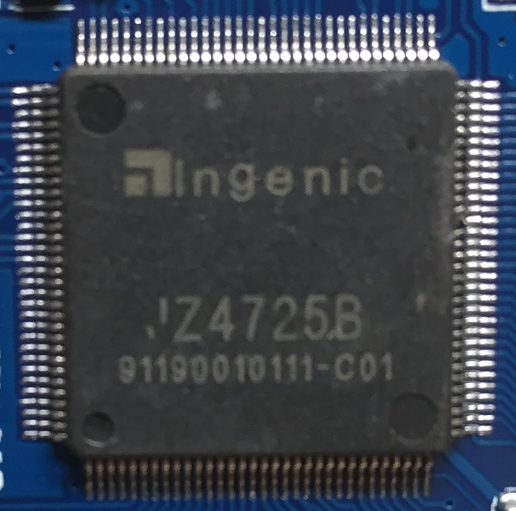

# RetroMini-Analysis
Analysing the Chinese RetroMini GBA Clone Console

The RetroMini is a GBA emulation clone console manufactured in China. This repo will store all information found during the teardown and analysis of the console. The goal of this analysis is to find a way to dump the console's firmware and eventually improve it.

Console Version: RETRO_MINI_V2.1 2017.11.3

#PCB

**PCB Front**

**PCB Back**

#Chips

##SOC

**Ingenic JZ4725B**

[Datasheet](ftp://ftp.ingenic.com/SOC/JZ4725B/JZ4725B_DS.PDF)

##RAM
**32x16SDRAM**

64MB Generic SDRAM

##Memory

**Hynix HY27UF082G2B**

2Gb NAND FLASH

[Datasheet](www.hynix.com/product/filedata/fileDownload.do?seq=4182)

